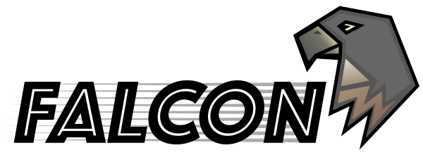

# 

Falcon is a multi-process, multi-fiber Rack HTTP server built on top of [async], [async-io], [async-container] and [async-http]. Each request is run within a light weight fiber and can block on up-stream requests without stalling the entire server process. Supports HTTP/1 and HTTP/2 natively. [Paid business support](#business-support) is available.

[](http://travis-ci.org/socketry/falcon)
[](https://codeclimate.com/github/socketry/falcon)
[](https://coveralls.io/r/socketry/falcon)

[async]: https://github.com/socketry/async
[async-io]: https://github.com/socketry/async-io
[async-container]: https://github.com/socketry/async-container
[async-http]: https://github.com/socketry/async-http

## Motivation

I've set up plenty of development and production environments for Ruby where you use some combination of Linode, AWS, Nginx, Passenger, Puma, Unicorn, Rails, Sinatra, etc. Every layer you add increases deployment complexity, latency and additionally, almost none of these platforms really support the full scope of what HTTP is capable of. This is especially true when building an unholy alliance of any of the above technologies, since each part of the stack imposes it's own limitations.

I want the same environment for development, testing, staging and production, and I want it to be both simple, informative, and fast. Falcon can work in all these environments, and defaults to HTTP/2 over HTTPS for localhost development. Consistency in your stack helps to catch bugs before they reach production, and simplifies your production environment.

Falcon is designed to be both a production quality front-end web server for Ruby applications, and an awesome development tool.

## Installation

Add this line to your application's Gemfile:

```ruby
gem 'falcon'
```

And then execute:

	$ bundle

Or install it yourself as:

	$ gem install falcon

## Usage

You can run `falcon serve` directly, and it will load the `config.ru` and start serving on https://localhost:9292.

### Integration with Rails

Falcon works perfectly with `rails` apps.

Add `gem 'falcon'` to your `Gemfile` and perhaps remove `gem 'puma'` once you are satisified with the change.

Run `RACK_HANDLER=falcon rails server` to start the server (at least, until [rack#181](https://github.com/rack/rack/pull/1181) is merged). Alternatively, if you want to use `HTTP/2`, run `falcon serve` directly.

### WebSockets

Falcon supports `rack.hijack` for HTTP/1.x connections. You can thus use [async-websocket] in any controller layer to serve WebSocket connections.

[async-websocket]: https://github.com/socketry/async-websocket

#### ActionCable

The `rack.hijack` functionality is compatible with ActionCable. If you use the `async` adapter, you should run falcon in threaded mode, or in forked mode with `--concurrency 1`. Otherwise, your messaging system will be distributed over several processes with no IPC mechanism.

### Integration with Guard

Falcon can restart very quickly and is ideal for use with guard. See [guard-falcon] for more details.

[guard-falcon]: https://github.com/socketry/guard-falcon

### Integration with Capybara

Falcon can run in the same process on a different thread, so it's great for use with Capybara (and shared ActiveRecord transactions). See [falcon-capybara] for more details.

[falcon-capybara]: https://github.com/socketry/falcon-capybara

### Using with Rackup

You can invoke Falcon via `rackup`:

	rackup --server falcon

This will run a single-threaded instance of Falcon.

## Performance

Falcon is uses an asynchronous event-driven reactor to provide non-blocking IO. It can handle an arbitrary number of in-flight requests with minimal overhead per request.

It uses one Fiber per request, which yields in the presence of blocking IO.

- [Improving Ruby Concurrency](https://www.codeotaku.com/journal/2018-06/improving-ruby-concurrency/index#performance) – Comparison of Falcon and Puma.

### Memory Usage

Falcon uses a pre-fork model which loads the entire rack application before forking. This reduces per-process memory usage. 

[async-http] has been designed carefully to minimize IO related garbage. This avoids large per-request memory allocations or disk usage, provided that you use streaming IO.

## Business Support

If you use this software for business purposes, please consider purchasing Business Support. The agreement will give you:

- Better software through funded development and testing.
- Access to advanced features (outlined below).
- Advance notification of bugs and security issues.
- Priority consideration of feature requests and bug reports.
- Private support and assistance via direct email.

The price for business support is $600.00 USD / project / year. Please [contact us](mailto:context@oriontransfer.co.nz?subject=Falcon%20Business%20Support) for more details.

### "Stretch" Goals

I would like to invest more time in business specific features. For each paying project as outlined above, one vote is available to prioritize the below work.

- Add support for push promises and stream prioritization in [async-http].
- Add support for rolling restarts in [async-container].
- Add support for hybrid process/thread model in [async-container].
- Asynchronous Postgres and MySQL database adapters for ActiveRecord in [async-postgres] and [async-mysql].

[async-http]: https://github.com/socketry/async-http
[async-container]: https://github.com/socketry/async-container
[async-postgres]: https://github.com/socketry/async-postgres
[async-mysql]: https://github.com/socketry/async-mysql

## Contributing

1. Fork it
2. Create your feature branch (`git checkout -b my-new-feature`)
3. Commit your changes (`git commit -am 'Add some feature'`)
4. Push to the branch (`git push origin my-new-feature`)
5. Create new Pull Request

## License

Released under the MIT license.

Copyright, 2018, by [Samuel G. D. Williams](http://www.codeotaku.com/samuel-williams).

Permission is hereby granted, free of charge, to any person obtaining a copy
of this software and associated documentation files (the "Software"), to deal
in the Software without restriction, including without limitation the rights
to use, copy, modify, merge, publish, distribute, sublicense, and/or sell
copies of the Software, and to permit persons to whom the Software is
furnished to do so, subject to the following conditions:

The above copyright notice and this permission notice shall be included in
all copies or substantial portions of the Software.

THE SOFTWARE IS PROVIDED "AS IS", WITHOUT WARRANTY OF ANY KIND, EXPRESS OR
IMPLIED, INCLUDING BUT NOT LIMITED TO THE WARRANTIES OF MERCHANTABILITY,
FITNESS FOR A PARTICULAR PURPOSE AND NONINFRINGEMENT. IN NO EVENT SHALL THE
AUTHORS OR COPYRIGHT HOLDERS BE LIABLE FOR ANY CLAIM, DAMAGES OR OTHER
LIABILITY, WHETHER IN AN ACTION OF CONTRACT, TORT OR OTHERWISE, ARISING FROM,
OUT OF OR IN CONNECTION WITH THE SOFTWARE OR THE USE OR OTHER DEALINGS IN
THE SOFTWARE.
